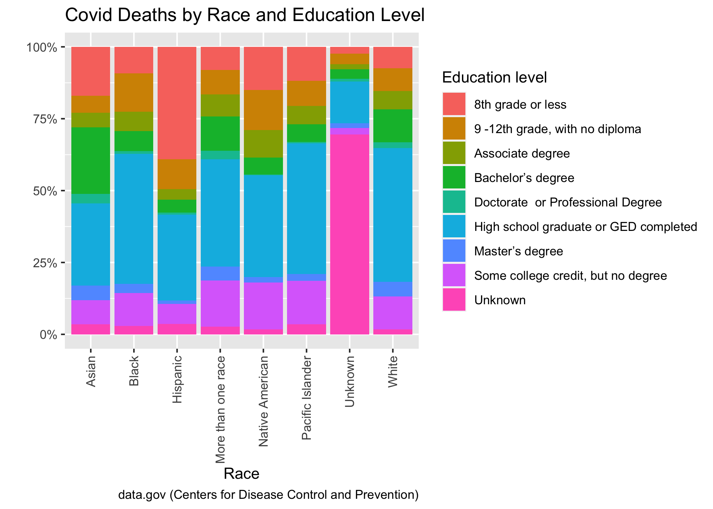

```{r setup, include=FALSE}
knitr::opts_chunk$set(echo = FALSE)

# Learn more about creating websites with Distill at:
# https://rstudio.github.io/distill/website.html

# Learn more about publishing to GitHub Pages at:
# https://rstudio.github.io/distill/publish_website.html#github-pages
library(knitr)
```

```{r}

```
Although it affects everyone across education levels, those who have a lesser education on average have a higher chance of being affected by COVID.
